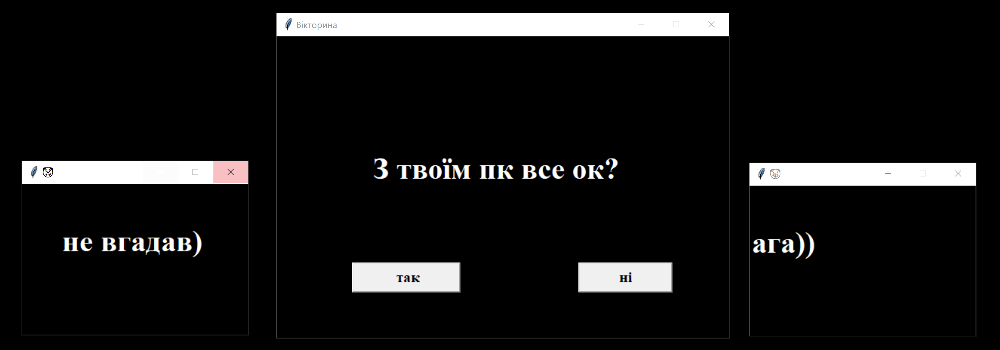

# Troll_python_program

Суть проекту це створення програми для приколу над другом, все що потрібно це надіслати другу .exe файл та щоб він відкрив программу :)

### В чому суть? 

Після того як друг відкриє программу він не зможе її просто так закрити завдяки функції "crash" та методу "messagebox" бібліотеки tkinter, функція "crash" виключає комп'ютер, вона викликається коли колистувач намагається закрити программу через хрестик або диспетчер задач, також программа підключається до камери ноутбука та робить знімок, після чого ставить цей знімок на обої робочого стола)